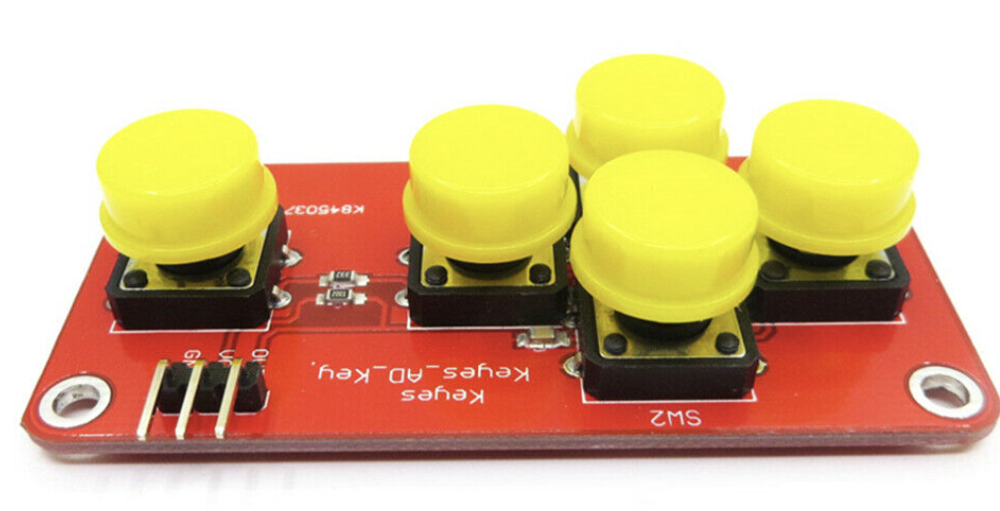

# :video_game: AdKeyboard Arduino Library :video_game: 
----
#### The library to control your Arduino AdKeyboard easier !!

You can buy this kind of keyboard [here](https://www.ebay.com/itm/144292596073)  


**You can control some keyboards like this or others with 3 pins : 
- VCC 
- GROUND 
- an OUT / S etc




---

## Installation

:one: **Download the release of the library :** 
.

:two: **Add this file into your libraries Arduino folder**.

## Usage
In your file ***.ino*** add this : 
```sh
#include "AdKeyboard_manager.h"
```

To controll the different keys : 
```sh
  if (tempKey == DOWN ) { go down }  
  if (tempKey == UP ) { go up }  
  if (tempKey == RIGHT ) { go right } 
  if (tempKey == LEFT ) { go left }
  if (tempKey == -1 ) { no key push }
```


## License

MIT

